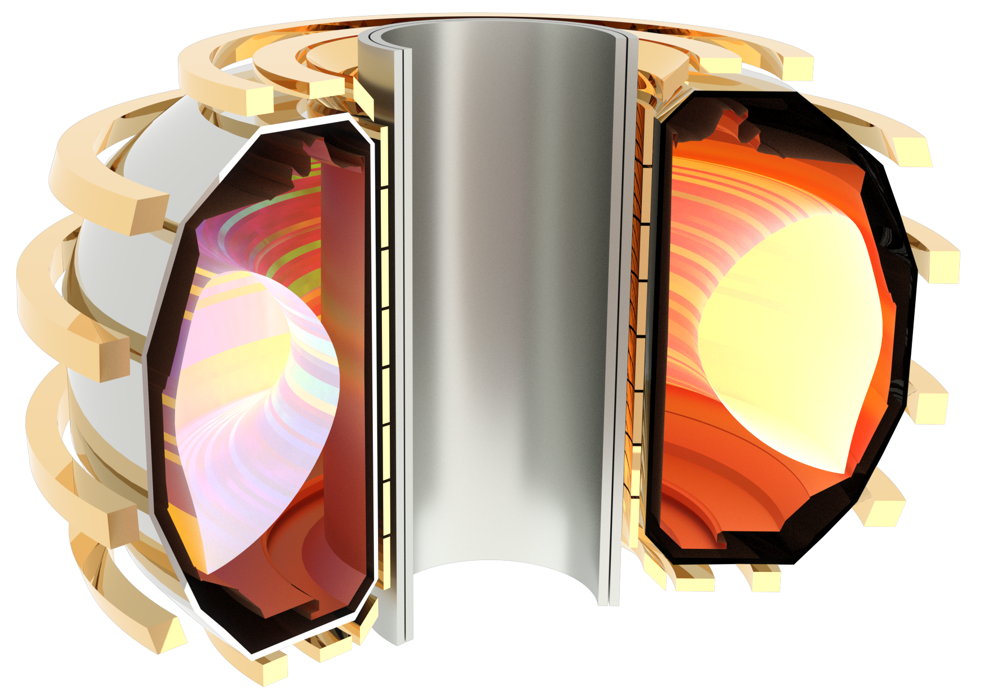

### Enabling Fusion Reactors with Negative Triangularity Configurations

More information coming soon! 

### Development and Assesment of Tokamak Control 

More information coming soon!

### Automated and Optimized Tokamak Equilibrium Reconstruction

More information coming soon!

### Exploration of Negative Triangularity on Spherical Tokamaks

More information coming soon!

### Cross-machine Comparison of Non-ELMing Regiemes

More information coming soon!
